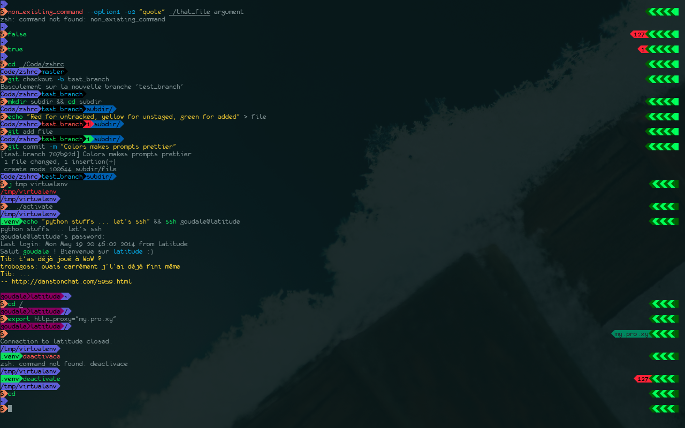

My Zero Shell config files !
============================

Have a quick overview
---------------------

Use me
------
Clone me, then

* cd zshrc
* ln -s $PWD/zshrc $HOME/.zshrc       
* ln -s $PWD/zsh $HOME/.zsh
* zsh

Include
-------

  * syntax highlight
  * battery state
  * 256 colors
  * various stuff

Note
----
Have a look to [Powerline](https://github.com/Lokaltog/powerline "Powerline github") to get that arrow symbol.
If for some reason you don't won't to use it, please have a look at zsh/prompt.zsh to use another symbol as separator.

Todo
----

  * Clean git support

